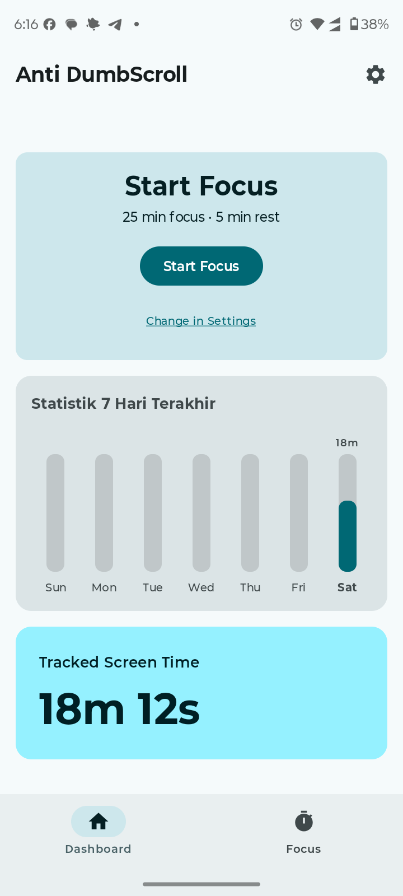
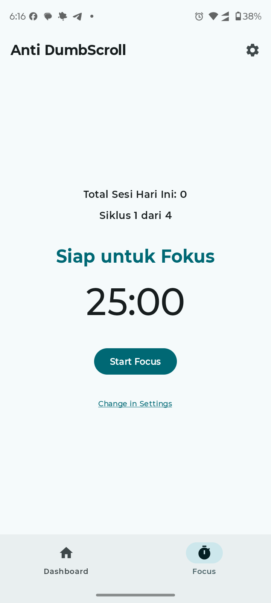
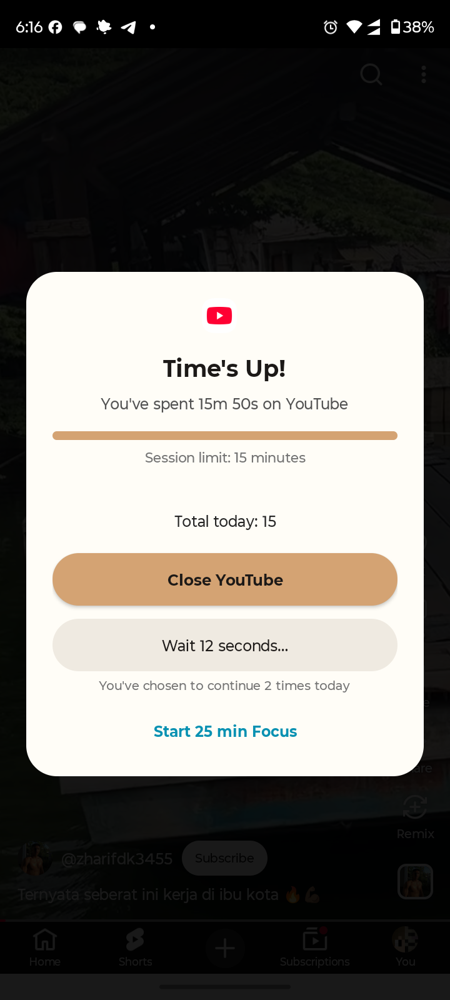

<div align="center">


# Anti DumbScroll

### Pembatas doomscrolling dan pelatih fokus untuk Android

<br/>

[](https://github.com/hekalabs-studio/Anti-Doomscrolling/releases)
[](LICENSE)
[](https://github.com/hekalabs-studio/Anti-Doomscrolling)

<br/>

[**Unduh**](#unduh) · [**Tampilan**](#tampilan) · [**Fitur**](#fitur) · [**Pemasangan**](#pemasangan) · [**Izin**](#izin-dan-alasannya) · [**FAQ**](#faq) · [**Dukung**](#dukung-proyek-ini)

</div>

> [!WARNING]
> **Status: BETA.** Aplikasi ini masih dalam tahap pengujian. Aplikasi yang memakai layanan Aksesibilitas bisa berperilaku berbeda di tiap merek HP, terutama yang punya penghemat baterai agresif. Laporkan masalah lewat [Issues](https://github.com/hekalabs-studio/Anti-Doomscrolling/issues).

> [!NOTE]
> **Peringatan saat memasang.** Karena aplikasi ini memakai layanan Aksesibilitas dan dipasang dari luar Play Store, Google Play Protect dan beberapa aplikasi perbankan bisa menandainya. Ini bukan hasil pemindaian virus, tetapi aturan berbasis izin. Baca bagian [Pemasangan](#pemasangan) dan [Privasi](#privasi) sebelum memasang.

---

<div align="center">

<h1><a id="tampilan"></a>Tampilan</h1>





</div>

---

<div align="center">

<h1><a id="fitur"></a>Fitur</h1>

<table>
  <tr>
    <td width="50%" valign="top">

#### Batas waktu per aplikasi
- Pilih sendiri aplikasi yang ingin dibatasi
- Aplikasi di luar daftar tidak dihitung dan tidak diganggu
- Batas waktu sesi yang bisa diatur
- Peringatan lembut sebelum batas tercapai

</td>
    <td width="50%" valign="top">

#### Layar jeda
- Menutup layar saat batas tercapai
- Menampilkan lama pemakaian, batas, dan total hari ini
- Tombol "Tutup aplikasi" untuk keluar
- Tombol tambahan waktu singkat dengan hitung mundur

</td>
  </tr>
  <tr>
    <td width="50%" valign="top">

#### Mode Fokus (Pomodoro)
- Fokus, istirahat pendek, dan istirahat panjang yang bisa diatur
- Aplikasi pengganggu diblokir selama fase fokus
- Notifikasi dengan hitung mundur dan aksi Jeda/Akhiri
- Timer tetap akurat saat aplikasi ditutup

</td>
    <td width="50%" valign="top">

#### Ringkasan & antarmuka
- Dashboard pemakaian harian
- Pencapaian sederhana
- Tombol Mulai cepat dari Dashboard
- Tutorial awal yang memandu pemberian izin

</td>
  </tr>
</table>

</div>

### Rencana pengembangan

- [ ] Tangga hambatan (jeda makin lama setiap kali memilih lanjut)
- [ ] Streak harian dan milestone
- [ ] Pertanyaan kuis singkat sebagai pengganti scrolling
- [ ] Versi tanpa layanan Aksesibilitas (UsageStats + overlay)

Daftar ini adalah rencana, bukan janji tanggal rilis.

---

<div align="center">

<h1><a id="unduh"></a>Unduh Aplikasi</h1>

<p>Unduh berkas instalasi <code>.apk</code> resmi melalui tombol di bawah ini:</p>

<a href="https://github.com/hekalabs-studio/Anti-Doomscrolling/releases/latest">
  
</a>
&nbsp;&nbsp;
<a href="https://github.com/hekalabs-studio/Anti-Doomscrolling/releases">
  
</a>

</div>

> [!TIP]
> Buka halaman [GitHub Releases](https://github.com/hekalabs-studio/Anti-Doomscrolling/releases) lalu unduh berkas `.apk` pada bagian **Assets**. Aplikasi ini belum tersedia di Google Play.

---

<h1><a id="pemasangan"></a>Pemasangan</h1>

1. **Unduh APK** dari halaman Releases.
2. **Izinkan pemasangan** dari sumber tidak dikenal untuk aplikasi yang kamu pakai membukanya (peramban atau pengelola berkas) saat diminta.
3. **Play Protect.** Jika muncul pesan *"App blocked to protect your device"* (aplikasi diblokir), itu karena aplikasi meminta izin Aksesibilitas dan dipasang dari luar Play Store. Pilih opsi yang tersedia di perangkatmu. Jika tidak ada opsi untuk melanjutkan, pengembang dapat memasang lewat kabel USB dan ADB (`adb install anti-dumbscroll.apk`). Hasilnya dapat berbeda di tiap perangkat, dan kami tidak dapat menjaminnya.
4. **Buka aplikasi** dan ikuti tutorial awal.
5. **Aktifkan layanan Aksesibilitas** di Pengaturan saat diminta.
6. **Jika tombol Aksesibilitas abu-abu / "Pengaturan terbatas"** (Android 13 ke atas, aplikasi dari luar Play Store): buka *Pengaturan → Aplikasi → Anti DumbScroll → ⋮ (menu tiga titik) → Izinkan pengaturan terbatas*, lalu coba lagi.
7. **Atur baterai** aplikasi ke *Tanpa batasan* agar layanan tidak dimatikan sistem, terutama di HP Xiaomi, Oppo, Vivo, dan Samsung.

> [!IMPORTANT]
> **Aplikasi perbankan.** Beberapa aplikasi bank memeriksa layanan Aksesibilitas dari sumber di luar Play Store dan bisa membatasi dirinya sendiri. Itu keputusan keamanan aplikasi bank tersebut dan di luar kendali kami. Jika terjadi, pertimbangkan untuk menonaktifkan layanan sementara saat memakai aplikasi bank, atau menghapus Anti DumbScroll.

> [!NOTE]
> **Verifikasi developer Android.** Google menerapkan aturan pendaftaran developer untuk pemasangan di luar Play Store di sejumlah negara, termasuk Indonesia. Pengaruhnya terhadap pemasangan APK dari GitHub dapat berubah. Lihat [developer.android.com/developer-verification](https://developer.android.com/developer-verification).

---

<h1><a id="izin-dan-alasannya"></a>Izin dan alasannya</h1>

| Izin | Untuk apa | Wajib? |
|---|---|---|
| Layanan Aksesibilitas | Mengetahui aplikasi mana yang sedang dibuka agar waktunya bisa dihitung dan layar jeda ditampilkan | Ya |
| Notifikasi | Menampilkan status pemantauan dan hitung mundur Mode Fokus | Disarankan |
| Layanan latar depan (foreground service) | Menjaga timer Mode Fokus berjalan akurat | Ya, untuk Fokus |
| Mematikan proses latar belakang | Membersihkan proses aplikasi yang kamu tutup lewat tombol "Tutup" | Opsional |
| Pengecualian optimasi baterai | Mencegah sistem mematikan layanan | Disarankan |

Daftar ini mengikuti `AndroidManifest.xml` dan dapat berubah antarversi. Selalu periksa daftar izin yang ditampilkan saat memasang.

---

<h1><a id="privasi"></a>Privasi</h1>

- Semua data (daftar aplikasi, pengaturan, statistik) **disimpan di perangkatmu**.
- Layanan Aksesibilitas hanya digunakan untuk mengetahui **nama aplikasi dan jendela yang sedang aktif**. Aplikasi ini tidak membaca isi layar, pesan, input teks, atau kata sandi.
- Aplikasi tidak mengirim data ke server dan tidak memuat pustaka iklan atau analitik. *(Pernyataan ini harus diverifikasi ulang setiap kali ada perubahan kode atau dependensi.)*

Rincian lengkap ada di [PRIVACY.md](PRIVACY.md).

---

<h1>Cara kerja dan batasan</h1>

- **"Tutup aplikasi" tidak mematikan paksa aplikasi lain.** Android tidak mengizinkan aplikasi biasa melakukannya. Tombol ini mengirimmu ke Beranda lalu meminta sistem membersihkan proses latar belakang aplikasi tersebut. Sistem dapat menghidupkannya kembali.
- **Layanan bisa berhenti** bila sistem atau penghemat baterai mematikannya. Aplikasi akan menandai pemantauan tidak aktif, tetapi pemulihan perlu tindakanmu.
- **Bukan alat pengawasan orang lain.** Aplikasi dirancang agar pengguna membatasi dirinya sendiri, dan pengguna selalu dapat menonaktifkan layanan lewat pengaturan sistem.

---

<h1><a id="faq"></a>FAQ</h1>

**Apakah aplikasi ini virus? Kenapa Play Protect memblokirnya?**
Bukan. Pemblokiran berasal dari aturan yang menyasar aplikasi dari luar Play Store yang meminta izin sensitif seperti Aksesibilitas, apa pun isinya. Kode sumbernya terbuka di repositori ini sehingga bisa kamu periksa sendiri.

**Kenapa aplikasi bank saya memberi peringatan?**
Lihat catatan [Aplikasi perbankan](#pemasangan) di atas.

**Apakah aplikasi ini gratis?**
Ya. Aplikasi gratis dan berlisensi GPL-3.0. Donasi bersifat sukarela dan tidak membuka fitur apa pun.

**Apakah ada di Play Store?**
Belum.

**Aplikasi tidak memblokir apa pun, kenapa?**
Pastikan: (1) layanan Aksesibilitas aktif, (2) aplikasi yang ingin dibatasi sudah ada di daftar, (3) baterai aplikasi diatur ke *Tanpa batasan*, (4) batas waktu belum terlalu panjang.

---

<h1>Membangun dari sumber</h1>

1. Pasang [Android Studio](https://developer.android.com/studio) versi terbaru.
2. Klona repositori:
   ```bash
   git clone https://github.com/hekalabs-studio/Anti-Doomscrolling.git
   ```
3. Buka folder proyek di Android Studio dan tunggu sinkronisasi Gradle selesai.
4. Bangun APK debug:
   ```bash
   ./gradlew assembleDebug
   ```
   Hasilnya ada di `app/build/outputs/apk/debug/`.
5. Untuk APK rilis, buat keystore milikmu sendiri dan tandatangani. **Jangan pernah meng-commit keystore atau kata sandinya.**

---

<h1>Berkontribusi</h1>

- Laporan bug dan saran sangat membantu. Buka [Issue](https://github.com/hekalabs-studio/Anti-Doomscrolling/issues) dan sertakan merek HP, versi Android, langkah mengulang masalah, dan tangkapan layar atau log bila ada.
- Untuk perubahan kode, diskusikan lewat Issue terlebih dulu.
- Dengan mengirim kontribusi, kamu setuju kontribusimu dilisensikan di bawah GPL-3.0.

---

<div align="center">

<h1><a id="dukung-proyek-ini"></a>Dukung proyek ini</h1>

<h3>Anti DumbScroll gratis dan open source. Kalau aplikasi ini membantu, kamu bisa mendukung pengembangannya. Tidak wajib.</h3>

<a href="https://hekalabs-donation.vercel.app">
  
</a>

</div>

---

<div align="center">

<h1>Terima kasih</h1>

- **Android Jetpack** (Compose, Navigation 3, Material 3, dan pustaka AndroidX lain) beserta seluruh komunitas open source di baliknya.
- **Gemini (Google)** yang membantu pembuatan logo dan menemani proses pengembangan di Android Studio.
- Para penguji dan semua yang melaporkan bug.

Daftar lengkap pustaka dan lisensinya ada di layar **Tentang** dalam aplikasi.

</div>

---

<h1>Lisensi</h1>

Kode sumber dilisensikan di bawah **GNU General Public License v3.0**. Lihat berkas [LICENSE](LICENSE).

Nama **Anti DumbScroll** dan logonya adalah milik Hekalabs Studio dan tidak untuk dipakai pada produk turunan.

---

<div align="center">

<h1>Penafian</h1>

Proyek ini **tidak berafiliasi, didanai, diizinkan, atau didukung** oleh Google LLC, YouTube, Instagram, TikTok, Meta, atau pihak lain yang disebut. Semua merek dagang dan hak kekayaan intelektual yang disebut adalah milik pemiliknya masing-masing.

Aplikasi ini adalah alat bantu kebiasaan digital, bukan layanan medis atau psikologis.

</div>

---

<div align="center">

<br/>

**Dibuat oleh [Hekalabs Studio](https://github.com/hekalabs-studio)**
Kontak: [hekoding@gmail.com](mailto:hekoding@gmail.com)

© 2026 Hekalabs Studio

</div>
